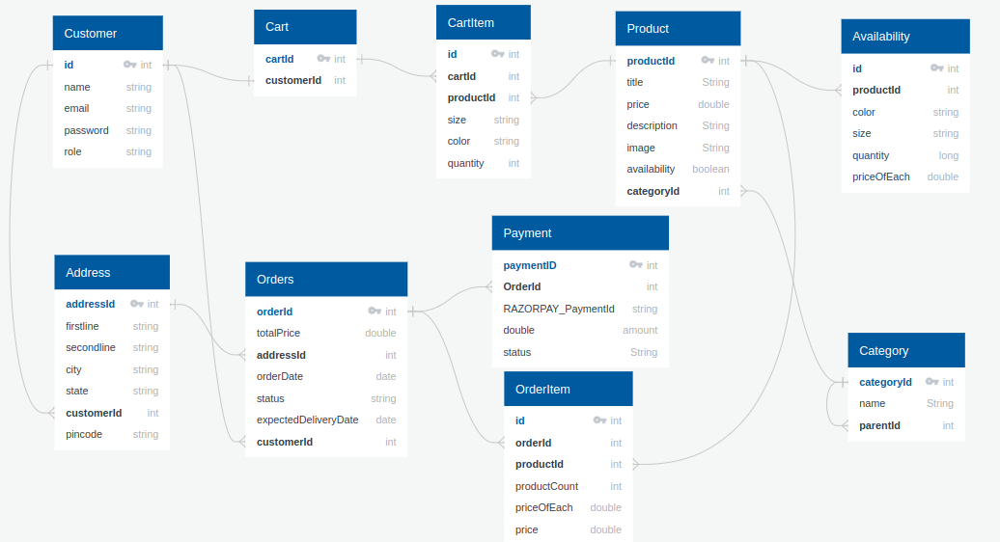

# ecommerce-assignment

## Introduction

The purpose of this repository is to use Java, Spring Boot, MySQL, Spring Security with JWT Authentication to create a basic e-commerce backend app.

## Project Type

Backend

## Deplolyed App

Backend: Not Deployed

## ER-Diagram



## Video Walkthrough of the project

[Click Me To Watch Video Presentation](https://drive.google.com/drive/folders/1YGxeInEFgxPOcPJ45Zvgv68NV_vuKLPY?usp=sharing)

## Features

##### User

- Register a new User and log in to get JWT Token
- Add product to Cart and remove item from Cart
- Retrieve products from Cart

##### Admin

- Admin register, Log In to get JWT Token
- Add product in database

## Design decisions or assumptions

- Considered a small level application

## Installation & Getting started

- Download or clone the repositor using ``
- Create Database ecommerce_xindus using `CREATE DATABASE ecommerce_db`
- Set username, password, url in application.properties file.

```java
spring.datasource.url=jdbc:mysql://127.0.0.1:3306/ecommerce_db
spring.datasource.username=yourUsernameMYSQL
spring.datasource.password=yourPassword
spring.datasource.driver-class-name=com.mysql.cj.jdbc.Driver
```

- Open ecommerce directory with STS/Intellij and start the app

## API Endpoints

##### Cart

GET /api/cart - retrieve user's cart products 🔐

POST /api/cart - create a new cartItem 🔐

PATCH /api/cart/{id} - update cart item 🔐

DELETE /api/cart/{id} -remove cart item by id 🔐

##### Users

GET /api/users/signIn - sign In to get token 🔐

POST /api/users - create new User

##### Products

POST /api/admin/products - create new product 🔐

POST /api/admin - create new Admin

GET /api/products - retrieve all products

GET /api/products/{id} - retrieve product by id

##### Categories

GET /api/categories - Retrieve all categories

##### Orders

POST /api/orders - create a new Order 🔐

GET /api/orders - retrieve all orders made by user (i.e order history) 🔐

GET /api/orders/{id} - retrieve order detail 🔐

##### PAYMENT

GET /api/orders/{id}/payment - retrieve URL to make payment

GET /api/orders/ 🔐

## Technology Stack

- Java
- Spring Boot
- MySQL
- Spring Security with JWT Token
- Git

## Postman collection

- I have provided the json file of my postman collection at root folder of repository so if you are running locally you can use that by importing option that is available on postman.
- Don't forget to change Environment variables in postman collection while using.
:[JSON POSTMAN COLLECTION](/E-commerce%20Masai%20Assignment.postman_collection.json)
